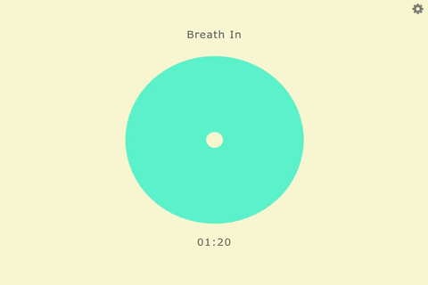

# breath focus

Get yourself comfortable and follow breathing into a regular rhythm until you feel better.

## Demo

http://projects.glicer.com/breath-focus/

## Usage

It is built with CSS/JavaScript.

The default breath timer is 5 minutes.

The default speed is 6 breaths per minute.

Get yourself comfortable, click start button and follow breathing when ready.

## License 

MIT

## Contact

Authors : Rym BOUCHAGOUR & Emmanuel ROECKER

Web Development Blog - http://dev.glicer.com

